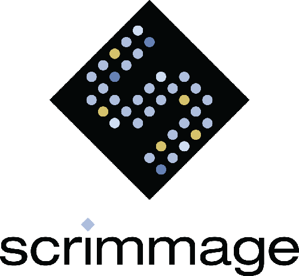
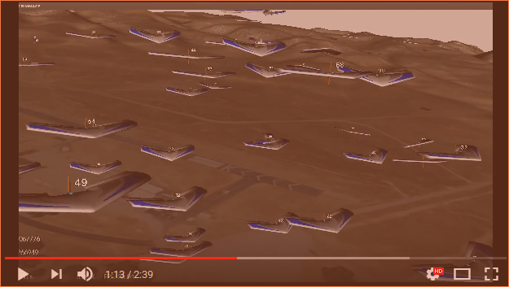

# SCRIMMAGE Multi-Agent Simulator

## Welcome to SCRIMMAGE

SCRIMMAGE is a multi-agent simulator for robotics research. It has been used to
conduct studies in multi-agent task assignment, differential game theory, novel
controllers, and reinforcement learning.

### SCRIMMAGE Demonstration Video

## Online Documentation

[Tutorials](http://www.scrimmagesim.org/docs/sphinx/html/index.html)

[SCRIMMAGE API](http://www.scrimmagesim.org/docs/doxygen/html/index.html)

## Citation

If you use SCRIMMAGE in your research, please cite our research paper:

    @inproceedings{demarco2018,
        title={Simulating Collaborative Robots in a Massive Multi-Agent Game Environment ({SCRIMMAGE})},
        author={DeMarco, Kevin and Squires, Eric and Day, Michael and Pippin, Charles},
        booktitle={Int. Symp. on Distributed Autonomous Robotic Systems},
        year={2018},
    }

## Build SCRIMMAGE

### Directory Setup

SCRIMMAGE developers and users may use multiple scrimmage-related projects and
repositories. Thus, it is recommended to group your scrimmage-related projects
under a single directory, but it is not necessary. To create a directory to
hold your scrimmage projects and clone this scrimmage repo, run the following
commands:

    $ mkdir -p ~/scrimmage && cd ~/scrimmage
    $ git clone https://github.com/gtri/scrimmage.git

### Install Binary Dependencies

A list of the Ubuntu packages required is provided in
./setup/install-binaries.sh in the "DEPS_DPKG" array. Run our automated
installer to install the required packages:

    $ cd scrimmage
    $ sudo ./setup/install-binaries.sh -e 0 -p 3

The first argument `-e 0` says to install all dependencies for all features in
SCRIMMAGE (you would use `-e 1` if you wanted to run SCRIMMAGE as part of an
embedded system). The second argument `-p 3` says to install python3
dependencies (use `-p a` for both python2 and 3 or `-p 2` for just python2
dependencies).

### Install Custom Built Binary Dependencies

Some of SCRIMMAGE's dependencies have to be custom built from source. We
provide deb package binaries via the SCRIMMAGE PPA on Launchpad for these
custom built packages. First, add the PPA to your apt-get sources:

    $ sudo add-apt-repository ppa:kevin-demarco/scrimmage
    $ sudo apt-get update

Now, install the SCRIMMAGE custom built binary dependencies:

    $ sudo apt-get install scrimmage-dependencies

Run the SCRIMMAGE setup script, which adds the ~/.scrimmage directory to your
local system and sets up some environment variables:

    $ source /opt/scrimmage/*/setup.sh

Note: If you need to build the dependencies from source or generate binary
packages, see [Build Dependencies from Source](./3rd-party/README.md)

### Build SCRIMMAGE Core

    $ mkdir build && cd build
    $ source ~/.scrimmage/setup.bash
    $ cmake ..
    $ make

### Environment Setup

Whenever, you want to use scrimmage, you need to source the
~/.scrimmage/setup.bash file or you can place a line in your ~/.bashrc file to
source it automatically:

    $ echo "source ~/.scrimmage/setup.bash" >> ~/.bashrc

## Run SCRIMMAGE

Open a new terminal, change to the scrimmage directory, and execute a mission.

    $ cd scrimmage
    $ scrimmage ./missions/straight.xml

You should see the visualization GUI open up and display the simulation.

## GUI Commands

The GUI responds to the following input keys:

    'q'                     : Quit the simulation
    'b'                     : (Break) Pauses and unpauses the simulation.
    'space bar'             : When paused, take a single simulation step.
    'a'                     : Rotate through the camera views
    'right/left arrows'     : Change the aircraft to follow
    '['                     : Decrease simulation warp speed
    ']'                     : Increase simulation warp speed
    '+'                     : Increase visual scale of all entities
    '-'                     : Decrease visual scale of all entities
    'r'                     : Reset visual scale and reset camera position
    'z'                     : Zoom out from entity
    'Z'                     : Zoom in to entity (z+shift)
    'w'                     : Display wireframe
    's'                     : Display solids (vs. wireframe)
    'CTRL + Left Click'     : Rotate world
    'SHIFT + Left Click'    : Translate camera through world

The GUI's camera can operate in three modes (cycle with 'a' key):
1. Follow the entity and point towards the entity's heading
2. Free floating camera
3. Follow the entity from a fixed viewpoint

Note: If all of the terrain data does not appear, click on the GUI window with
your mouse.

## Building on macOS

Refer [here](https://github.com/crichardson332/homebrew-crich_brews) for instructions on installing dependencies and running
SCRIMMAGE on macOS.

## Python Bindings

SCRIMMAGE's Python bindings depend on protobuf, GRPC, and pandas. Install the
appropriate versions of grpc and protobuf:

    $ sudo pip install protobuf==3.3.0 grpcio==1.2.1

You can specify a minimum Python version in SCRIMMAGE core by setting the
PYTHON\_MIN\_VERSION cmake variable. For example, to specify a minimum Python
3.0 version, first clear the cmake cache file and rerun cmake:

    $ rm CMakeCache.txt
    $ cmake .. -DPYTHON_MIN_VERSION=3.0

Otherwise, cmake will choose Python on it's own. CMake seems to find the
minimum version of Python specified. It should be noted that
`interactive_plots.py` uses wxPython which is only compatible with python2.

### Install SCRIMMAGE Python Bindings

To install scrimmage's python bindings:

    $ cd /path/to/scrimmage/python
    $ sudo pip install -e .

## Build SCRIMMAGE Documentation

    $ cd build
    $ cmake .. -DBUILD_DOCS=ON
    $ make docs

### View SCRIMMAGE API (Doxygen) Documentation

    $ firefox ./docs/doxygen/html/index.html

### View SCRIMMAGE Tutorial (Sphinx) Documentation

    $ firefox ./docs/sphinx/html/index.html

## Build and Run Tests

    $ cmake .. -DBUILD_TESTS=ON
    $ make
    $ make test

## Cleaning SCRIMMAGE

The scrimmage source code can be cleaned with the standard clean command:

    $ make clean

However, if you want to clean everything, you can remove your build directory:

    $ cd /path/to/scrimmage && rm -rf build

## ROS Integration

To build SCRIMMAGE's ROS plugins, you must have
[ROS](http://wiki.ros.org/ROS/Installation) installed and the
BUILD\_ROS\_PLUGINS cmake variable must be set:

    $ cmake .. -DBUILD_ROS_PLUGINS=ON

An example of using SCRIMMAGE to simulate robots running the ROS 2D Navigation
stack can be found in the
[scrimmage\_ros](https://github.com/SyllogismRXS/scrimmage_ros) package.

## MOOS Integration

If you want to use MOOS with SCRIMMAGE, you will first need to download and
build MOOS/MOOS-IVP according to the instructions at:
http://oceanai.mit.edu/moos-ivp/pmwiki/pmwiki.php?n=Site.Download

The MOOSAutonomy plugin interacts with the MOOSDB to synchronize time, exchange
contact information, and receive desired state from the IvP Helm. To build
MOOSAutonomy, you have to provide cmake with the path to the moos-ivp source
tree:

    $ cmake .. -DMOOSIVP_SOURCE_TREE_BASE=/path/to/moos-ivp

## FlightGear Multiplayer Server (FGMS) Integration

If you want to use FGMS with SCRIMMAGE, you will first need to download and
build FGMS according to the instructions at:
https://github.com/FlightGear/fgms

Clone the flight gear multiplayer server repository and build it:

    $ git clone https://github.com/FlightGear/fgms.git
    $ cd fgms
    $ git checkout 6669ac222b9f6ca34b0d56ba1bc6cac9cc0324b2
    $ mkdir build && cd build
    $ cmake .. -DBUILD_SHARED_LIB=ON
    $ make

The FGMS plugin interacts with SCRIMMAGE to receive the state variables of each
entity. To build FGMS, you have to provide SCRIMMAGE's CMake project the path
to the FGMS root source:

    $ cmake .. -DFGMS_SOURCE_TREE_BASE=/path/to/fgms

## Running SCRIMMAGE inside of Docker

The SCRIMMAGE docker image is pushed to a public repository after a successful
build on Travis. If docker is installed on your machine, you can obtain the
SCRIMMAGE docker image by running the following command:

    $ docker pull syllogismrxs/scrimmage:latest

You can pass mission files from your host machine to the `scrimmage` executable
inside of the docker container with the following command:

    $ cd /path/to/scrimmage/missions
    $ docker run --name my-scrimmage \
        -v ${PWD}/straight_jsbsim.xml:/straight_jsbsim.xml \
        syllogismrxs/scrimmage:latest /straight_jsbsim.xml

The previous command mounts the `straight_jsbsim.xml` mission file on your host
machine into the scrimmage container and then the `/straight_jsbsim.xml`
portion at the end of the command overwrites the default docker `CMD`, which is
defined in the Dockerfile. Finally, the `scrimmage` executable is passed the
`/straight_jsbsim.xml` mission file.

Since we provided a name for our container, we can easily extract the SCRIMMAGE
log files from the docker container:

    $ docker cp my-scrimmage:/root/.scrimmage/logs .

If you need to drop into a shell inside of the scrimmage container, you will
need to overwrite the docker image's ENTRYPOINT.

    $ docker run -it --entrypoint="/bin/bash" syllogismrxs/scrimmage:latest

Once inside of the container, you will need to source the `setup.bash` file
manually before running a mission.

    $ source ~/.scrimmage/setup.bash
    $ scrimmage ./missions/straight-no-gui.xml

## Building SCRIMMAGE for CentOS or RedHat

This repository contains a Dockerfile that builds a compiler with C++14
support, SCRIMMAGE's dependencies, and SCRIMMAGE for CentOS6 or RedHat6. RPMs
are built inside of the docker image and they can be extracted and install on a
CentOS or RedHat system. The user can change the package install prefix for all
RPMs by specifying the `PKG_PREFIX` docker build argument. Building the docker
image can take several hours:

    $ cd /path/to/scrimmage/ci/dockerfiles
    $ docker build --build-arg PKG_PREFIX=/opt/scrimmage \
                   --tag scrimmage/centos6:latest \
                   --file centos6 .

Extract the RPMs that were built to the host's `rpms` folder:

    $ docker create --name mycontainer scrimmage/centos6:latest
    $ docker cp mycontainer:/root/rpms ./rpms     # extract the rpms
    $ docker rm mycontainer                       # clean up container

Copy the `rpms` folder to your CentOS or RedHat system and install the run-time
dependencies:

    $ cd /path/to/rpms
    $ rpm -ivh scrimmage_gcc*.rpm \
             scrimmage_python*.rpm \
             scrimmage_boost*.rpm \
             scrimmage_geographiclib*.rpm \
             scrimmage_jsbsim*.rpm \
             scrimmage_grpc*.rpm \
             scrimmage_protobuf*.rpm \
             scrimmage_0.2.0*.rpm

To test that SCRIMMAGE was installed correctly, run the following command:

    $ export JSBSIM_ROOT=/opt/scrimmage/etc/JSBSim \
        && source /opt/scrimmage/etc/scrimmage/env/scrimmage-setenv \
        && scrimmage /opt/scrimmage/share/scrimmage/missions/straight-no-gui.xml

## Installing and Configuring Open Grid Engine

Instructions modified from:
    https://scidom.wordpress.com/2012/01/18/sge-on-single-pc/
    http://www.bu.edu/tech/support/research/system-usage/running-jobs/tracking-jobs/

Install Grid Engine:

    $ sudo apt-get install gridengine-master gridengine-exec \
      gridengine-common gridengine-qmon gridengine-client

Note that you can configure how qsub is called with a `.sge_request` in your
home directory. Further, you can set the number of available slots (cores
available) when running grid engine under the Queue Control tab.

## Installing and Configuring PostgreSQL

Install PostgreSQL and configure the database scrimmage, create user scrimmage with
password scrimmage, and add that user to the scrimmage database:

    $ sudo apt-get install postgresql postgresql-contrib
    $ sudo update-rc.d postgresql enable &&\
      sudo service postgresql restart &&\
      sudo -u postgres createdb scrimmage &&\
      sudo -u postgres psql -c "CREATE USER scrimmage with password 'scrimmage';" &&\
      sudo -u postgres psql -c "alter user scrimmage with encrypted password 'scrimmage'" &&\
      sudo -u postgres psql -c "grant all privileges on database scrimmage to scrimmage;"

Go into /etc/postgresql/9.5/main/pg_hba.conf (or similar path to your postgres
install) and change the line:

`local    all     all     peer`

to

`local    all     all     md5`

Then run:

    $ sudo service postgresql restart

This will allow us to authenticate the scrimmage user on postgres with the
password scrimmage that we created.

To use the python scripts for pulling .csv files to postgres, install psycopg2,
the python interface for postgres:

    $ pip install psycopg2

The scripts are located in the scripts directory.

## Troubleshooting

### Problem: I can't run the SCRIMMAGE GUI in a Virtual Machine (VirtualBox)

There are some OpenGL issues with VTK6 in Virtualbox. To run SCRIMMAGE in
VirtualBox with VTK5, run the following commands:

    $ sudo apt-get install libvtk5-dev
    $ cd ~/scrimmage/scrimmage/build      # Note: Path may vary
    $ cmake ..

At this point, cmake should output a message about finding VTK Version 5. Now,
you have to rebuild SCRIMMAGE:

    $ make

### Problem: I cannot load python libraries through scrimmage

Make sure that when you run the cmake command it is using the version of python
that you want to use with the following:

    $ cmake -DPYTHON_EXECUTABLE:FILEPATH=/usr/bin/python      \  # adjust path to your needs
            -DPYTHON_INCLUDE_DIR:PATH=/usr/include/python2.7  \  # adjust path to your needs
            -DPYTHON_LIBRARY:FILEPATH=/usr/lib/libpython2.7.so   # adjust path to your needs

### Problem: vtkRenderingPythonTkWidgets cmake Warning

When running cmake, the user gets the cmake warning:

    -- The imported target "vtkRenderingPythonTkWidgets" references the file
    "/usr/lib/x86_64-linux-gnu/libvtkRenderingPythonTkWidgets.so"
    but this file does not exist.  Possible reasons include:
    * The file was deleted, renamed, or moved to another location.
    * An install or uninstall procedure did not complete successfully.
    * The installation package was faulty and contained
    "/usr/lib/cmake/vtk-6.2/VTKTargets.cmake"
    but not all the files it references.

This is a VTK6 Ubuntu package bug. It can be ignored.

### Problem: Docker Container Can't Access Internet

Docker can have DNS issues. If you can ping a public ip address within a docker
image (such as 8.8.8.8), but you can't ping archive.ubuntu.com, create the file
/etc/docker/daemon.json with the following contents:

    {
        "dns": ["<DNS-IP>", "8.8.8.8"]
    }

Where `<DNS-IP>` is the first DNS IP address and <interfacename> is a network
interface with internet access from the commands:

    $ nmcli dev list | grep 'IP4.DNS'                    # Ubuntu <= 14
    $ nmcli device show <interfacename> | grep IP4.DNS   # Ubuntu >= 15

Restart docker:

    $ sudo service docker restart
