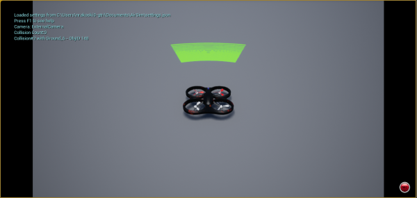
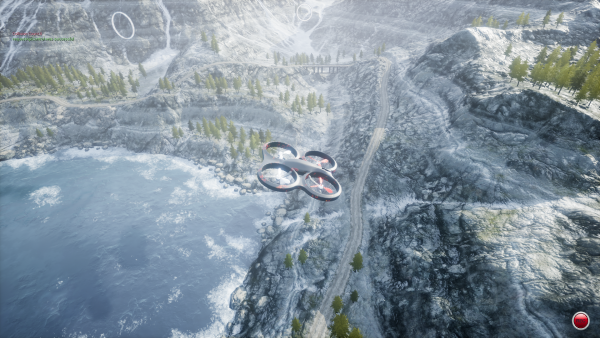
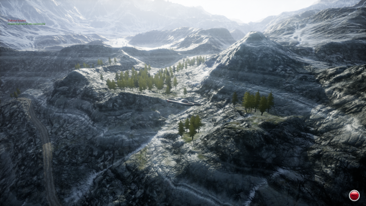

.. _airsim_plugin:

AirSimSensor Plugin Setup
=========================

SCRIMMAGE provides a sensor plugin that communicates over AirSim's RPC protocol
to set the position and orientation of an entity in AirSim and retrieve the
camera images generated by AirSim. The ``quad-airsim-ex1.xml`` mission file
provides an example for configuring SCRIMMAGE to use the AirSimSensor plugin
with a SCRIMMAGE entity. An example of extracting the image data from the
Sensor is provided in the Straight Autonomy plugin in the Straight.cpp file.

Linux System Setup
------------------

In order to run SCRIMMAGE and AirSim / Unreal on Linux, we will have to build
Unreal and AirSim from source. Some of the following directions were taken from
AirSim's build_linux.md documentation, but they are placed here for posterity.

.. Note:: The Unreal Engine uses libc++ while SCRIMMAGE uses libstdc++. You
          cannot easily link binaries that are built from one library with
          binaries that were built with the other library. The simplest way of
          dealing with this issue is to build the AirSim libraries/plugins in
          two different directories.

#. **Make sure you are registered with** `Epic Games`_. **This is required to get
   source code access for Unreal engine.**

#. **Clone Unreal in your favorite folder and build it (this may take a
   while!). Note: We only support Unreal 4.16 and newer.**

   .. code-block:: bash

      # go to folder where you clone GitHub projects
      git clone -b 4.17 https://github.com/EpicGames/UnrealEngine.git
      cd UnrealEngine
      # few times Epic folks broke the build so we will get commit that works
      git checkout af96417313a908b20621a443175ba91683c238c8
      ./Setup.sh
      ./GenerateProjectFiles.sh
      make

#. **Build the libstdc++ version of AirSim (which will be loaded into SCRIMMAGE)**

   .. code-block:: bash

      # go to folder where you clone GitHub projects
      git clone https://github.com/Microsoft/AirSim.git
      cd AirSim
      git checkout v1.1.8
      git apply /path/to/scrimmage/3rd-party/patches/airsim_build_updates.patch
      ./setup.sh
      cd cmake
      chmod +x gcc_build.sh
      ./gcc_build.sh

#. **Build the libc++ version of AirSim (which will be loaded into Unreal)**

   .. code-block:: bash

      # go to folder where you clone GitHub projects
      git clone https://github.com/Microsoft/AirSim.git AirSim-plugin
      cd AirSim-plugin
      git checkout v1.1.8
      ./setup.sh
      ./build.sh

#. **Build SCRIMMAGE's AirSimSensor Plugin**

   Make sure you have OpenCV installed on your system and that you have
   successfully built the AirSim libraries (using libstdc++) in step 3. Go to
   your scrimmage build directory and provide the location of the AirSim
   libraries (libstdc++ version) to cmake.

   .. code-block:: bash

      cd /path/to/scrimmage
      rm -rf build && mkdir build && cd build
      cmake .. -DAIRSIM_ROOT_SEARCH=/path/to/AirSim
      make

   Ensure that the ``AirSimSensor_plugin`` target built successfully.

#. **Open the Blocks Environment in Unreal**

   Go to the UnrealEngine repository that you cloned and run the UE4Editor
   binary that was built.

   .. code-block:: bash

      cd /path/to/UnrealEngine
      ./Engine/Binaries/Linux/UE4Editor

   Use the UE4Editor to open the Blocks project (Blocks.uproject) in the
   /path/to/AirSim-plugin/Unreal/Environments/Blocks directory. You will
   probably be prompted about updating the project version, say "Yes" to
   update. Now we have to sync the AirSim plugin with this updated project
   version. Close the project and UE4Editor and open a terminal.

   .. code-block:: bash

      cd /path/to/AirSim-plugin
      rsync -t -r Unreal/Plugins ./Unreal/Environments/Blocks\ Blocks 4.17

   Run the UE4Editor binary again and open the new Blocks 4.17 project. When
   you hit the "Play" button in the project, you should see a quadrotor appear
   on the screen and it may start flying around.

#. **Configure Settings**

   AirSim reads a json file located at ~/Documents/AirSim/settings.json to
   configure itself. SCRIMMAGE provides an example json file. After running
   AirSim one time, it will create the json file. Let's remove it and link to
   the one provided by SCRIMMAGE.

   .. code-block:: bash

      rm ~/Documents/AirSim/settings.json
      cd ~/Documents/AirSim
      ln -s /path/to/scrimmage/include/scrimmage/plugins/sensor/AirSimSensor/settings.json .

   Open the configuration file for the AirSimSensor SCRIMMAGE plugin, which is
   located at:
   /path/to/scrimmage/include/scrimmage/plugins/sensor/AirSimSensor/AirSimSensor.xml. Note
   that the ``airsim_ip`` and ``airsim_port`` XML tags can be used to connect
   to an AirSim instance on either the local computer or a remote networked
   computer. ``airsim_port`` (from AirSimSensor.xml) and ``ApiServerPort``
   (from settings.json) should match. Multiple simulated cameras can be
   configured through the ``camera_config`` example tag. This tag takes a list
   of camera configurations, where each camera configuration is of the form:
   ``[CameraName ImageType CameraNumber Width Height]``. The following example
   configures multiple simulated camera sensors:

   .. code-block:: xml

      <camera_config>
        [SceneForward Scene 0 256 144]
        [SceneDownward Scene 3 256 144]
        [DepthPlanner DepthPlanner 0 256 144]
        [DepthPerspective DepthPerspective 0 256 144]
        [DepthViz DepthVis 0 256 144]
        [DisparityNormalized DisparityNormalized 0 256 144]
        [Segmentation Segmentation 0 256 144]
        [SurfaceNormals SurfaceNormals 0 256 144]
      </camera_config>

   The ``CameraName`` is an arbitrary string that can be used by SCRIMMAGE
   plugins to identify camera images. The ImageType is a type defined by AirSim
   that specifies the type of camera (optical, depth, segmentation, etc.). The
   camera number refers to different camera translations and orientations on
   the Unreal actor instance. 0 looks forward, 3 looks down, etc.

#. **Run a simulation with AirSim Camera Images**

   After configuring settings.json and AirSimSensor.xml, you can run a
   simulation. Use the UE4Editor to open the updated Blocks environment and
   press "Play" to start the AirSim instance. Now, you can start the SCRIMMAGE
   instance, which will move the AirSim actor, request images, and display the
   images.

   .. code-block:: bash

      scrimmage /path/to/scrimmage/missions/quad-airsim-ex1.xml

   You should see camera images open in OpenCV windows when the SCRIMMAGE
   simulation begins (hit 'b' to unpause, if necessary).

Windows / Linux Setup
---------------------

You can run the Unreal Engine on a Windows computer and SCRIMMAGE on a Linux
computer. Make sure that you use the same version of AirSim
across your systems. For example, at the time that this tutorial was written
we used AirSim version v1.2.2 and Unreal Engine 4.18.3. If using a different version
of AirSim please check AirSim's Github Docs (https://microsoft.github.io/AirSim/docs/build_windows/)
for which version of Unreal Engine to use.

Linux
*****

Ubuntu 18.04 is recommended. If you haven't already installed SCRIMMAGE on your Linux machine, do so by following
directions here:(https://github.com/gtri/scrimmage). Also make sure that an OpenCV above version 3.0.0 is installed on
your Linux system, version 3.4.0+ is recommended. You will need to pull the code for AirSim v1.2.2 and build the
libstdc++ version of AirSim on your Linux computer. Then build SCRIMMAGE with the AirSim SCRIMMAGE plugin.

#. **Build the libstdc++ version of AirSim (which will be loaded into SCRIMMAGE)**

   .. code-block:: bash

      # If using Ubuntu 16.04, you may need to update to CMake 3.10
      # https://microsoft.github.io/AirSim/docs/cmake_linux/
      # Only do this if the AirSim build fails and requests it because it can
      # interfere with your ROS kinetic installation, read more here:
      # https://askubuntu.com/questions/829310/how-to-upgrade-cmake-in-ubuntu

      # go to folder where you clone GitHub projects
      git clone https://github.com/Microsoft/AirSim.git
      cd AirSim
      git checkout 1b10a49b004bf56195897813b6d3b4394b906f88

      # Select libstdc++ version build
      # Open both ./setup.sh and ./build.sh and change "gccBuild=false" to "gccBuild=true"
      nano ./setup.sh
      nano ./build.sh

      # Build
      ./setup.sh
      ./build.sh

#. **Build SCRIMMAGE's AirSimSensor Plugin**

   Make sure you have successfully built the AirSim libraries (using libstdc++) in step 1. Go to
   your scrimmage build directory and provide the location of the AirSim libraries to cmake.

   .. code-block:: bash

      cd /path/to/scrimmage
      rm -rf build && mkdir build && cd build
      cmake .. -DAIRSIM_ROOT_SEARCH=/path/to/AirSim
      make

   Ensure that the ``AirSimSensor_plugin`` target built successfully.

Windows
*******

You will need to install Unreal Engine on Windows and build AirSim. Make sure that Visual Studio 2017 is also installed
with the packages mentioned below.

#. **Install VS17 and Unreal Engine**

   * Install Unreal Engine 4.18 by following the directions for "Install Unreal Engine" here: (https://microsoft.github.io/AirSim/docs/build_windows/). Make sure to install Unreal 4.18 using the Epic Games launcher.

   * Make Sure Visual Studio 2017 is installed with **VC++** and **Windows SDK 8.1** packages.

#. **Fetch AirSim**

   Start the windows program **x64 Native Tools Command Prompt for VS 2017** -- it MUST be used for running all batch files.
   Clone the AirSim repo into or close to the *c:/ directory*, else you will receive errors during installation for file
   names being too long.

   .. code-block:: bash

      # In "x64 Native Tools Command Prompt for VS 2017" NOT GitBash
      cd c:\
      git clone https://github.com/Microsoft/AirSim.git
      cd AirSim && git checkout 1b10a49b004bf56195897813b6d3b4394b906f88

#. **Edit AirSim Build File**

   The batch file *build.cmd* has an error so we will edit the file and fix it before we build.

   .. code-block:: bash

      # We will add a pause to the end of the file because else the script will exit,
      # closing the window, very quickly after finishing even if there are build errors.
      # Adding this pause will allow you to check that AirSim built successfully.

      # Replace this code block from lines 185 to 194:
      ################################################### (Don't copy these ###'s into the file)
      REM //---------- done building ----------
      exit /b 0

      :buildfailed
      echo(
      echo #### Build failed - see messages above. 1>&2

      :buildfailed_nomsg
      chdir /d %ROOT_DIR%
      exit /b 1
      ##################################################

      # With this code block:
      ##################################################
      REM //---------- done building ----------
      REM // exit /b 0
      goto :done

      :buildfailed
      chdir /d %ROOT_DIR%
      echo(
      echo #### Build failed - see messages above. 1>&2
      pause
      exit /b 1

      :done
      pause
      ###################################################

#. **Build AirSim**

   Start the windows program **x64 Native Tools Command Prompt for VS 2017** and build AirSim:

   .. code-block:: bash

      cd C:\AirSim
      build.cmd

#. **SetUp Blocks Environment**

   We will follow the Windows instructions here to setup the Blocks environment:
   (https://microsoft.github.io/AirSim/docs/unreal_blocks/).

   Once you can run the AirSim simulation in Unreal, replace the settings.json in Windows:Documents\AirSim
   with the settings.json file in:
   (https://github.com/gtri/scrimmage/blob/master/include/scrimmage/plugins/sensor/AirSimSensor/settings.json)
   Now rebuild Blocks.sln which will launch Unreal, press play, if required choose quadcopter, and leave running.

Start Scrimmage on Linux and Connect to AirSim/Unreal on Windows
****************************************************************

Find the IP of the Windows machine that you are running AirSim/Unreal Engine and place it in the mission file
in scrimmage on your Linux machine. Run the mission in scrimmage, watch AirSim connect, and hit 'b' to start the
simulation.

#. **Edit Mission and Start Scrimmage on Linux Machine**

   .. code-block:: bash

      # Open "quad-airsim-ex1.xml" in /scrimmage/missions directory
      cd /path/to/scrimmage/missions
      # change line 60 to your IP
      <sensor airsim_ip="YOUR_IP">AirSimSensor</sensor>
      # Save and run the mission
      scrimmage ./quad-airsim-ex1.xml
      # Should connect successfully
      # hit 'b' key to start simulation
      # You should see 3 image streams appear in separate windows from the scrimmage window.
      # for directions on how to control scrimmage see scrimmage github:
      # (https://github.com/gtri/scrimmage)

Save Images and Get LIDAR data
******************************

To save the images and quaternion pose CSV from the simulation for later processing into the SCRIMMAGE logs directory
set save_airsim_data="true" in the scrimmage mission file quad-airsim-ex1.xml. The Scrimmage Logs directory should be
located in ~/.scrimmage/logs on the Linux side.

To retrieve Image data from the simulation set get_image_data="true" in the scrimmage mission file quad-airsim-ex1.xml.
Camera image types can be configured in scrimmage/include/scrimmage/plugins/sensor/AirSimSensor/AirSimSensor.xml

To retrieve LIDAR data from the simulation set get_lidar_data="true" in the scrimmage mission file quad-airsim-ex1.xml.
LIDAR and image settings can be changed in the settings.json file on the Windows side located in Documents\\AirSim.
See (https://github.com/microsoft/AirSim/blob/master/docs/lidar.md) for more details.
Lidar variable DrawDebugPoints in the settings.json file will show the LIDAR pointcloud in the simulation as seen in the
image below, however it will also appear in the saved images so by default it is set to false.

Publish Images and LIDAR data to ROS
************************************

To publish AirSim data to ROS you must build scrimmage with -DBUILD_ROS_PLUGINS=ON, example below. Uncomment the
"<autonomy>ROSAirSim</autonomy>" tag in the scrimmage mission file quad-airsim-ex1.xml. To publish image or lidar data
set "pub_image/lidar_data" to true within the ROSAirSim tag, however be sure to have "get_image/lidar_data" set to true
in the AirSimSensor tag above in order to receive the data. Setting "show_camera_images" to true will display images
from each camera type in OpenCV windows. By default images are shown using the ""<autonomy>Straight</autonomy>" tag in
quad-airsim-ex1.xml, this only needs to be specified once.

   .. code-block:: bash

      # Go into Scrimmage
      cd /path/to/scrimmage/
      # Delete build directory
      rm -rf build/ && mkdir build/ && cd build/
      # Config CMake to build SCRIMMAGE ROS Plugins
      cmake .. -DAIRSIM_ROOT_SEARCH=/home/nrakoski3/scrimmage/AirSim/ -DROS_VERSION=melodic -DBUILD_ROS_PLUGINS=ON
      # Build
      make -j7
      # Open a second Terminal window and start ROS
      roscore
      # Run from original Terminal window
      cd .. && scrimmage ./missions/quad-airsim-ex1.xml
      # Start RVIZ in a third Terminal window to visualize LIDAR data
      rviz ./scrimmage/include/scrimmage/plugins/autonomy/ROSAirSim/lidar.rviz

Run with Multiple Quadcopters
*****************************

COMING SOON

Add "Asset" Environments
**************************

AirSim offers photo-realistic environments that can be played(not edited) for every release version called **"Assets"**.
They can be found here: (https://github.com/Microsoft/AirSim/releases). Download one of the Asset ZIP files under your
AirSim version (here we used LandscapeMountains under v1.2.2) onto the Windows machine and place in the
directory: c:/AirSim/Unreal/Environments/. Assets for newer versions of AirSim will not work with older versions of
AirSim installed across your Linux/Windows machines. Use 7-Zip to extract by selecting "Extract to <ASSET_NAME>\\".
Inside the folder you will find a <ASSET_NAME>.exe application. Double click the application file to start the
environment, choose "no" for quadcopter. The environment will start in full-screen. Now start the scrimmage mission
on your Linux machine using "scrimmage ./missions/quad-airsim-ex1.xml". The scrimmage simulation will connect to
AirSim and control the car/ quadcopter in the new Asset environment. To end the simulation you will need to enter
the Task Manager by pressing CTRL+ALT+DELETE, select the Unreal process, and press "End Task".

.. _Epic Games: https://docs.unrealengine.com/latest/INT/Platforms/Linux/BeginnerLinuxDeveloper/SettingUpAnUnrealWorkflow/1/index.html
