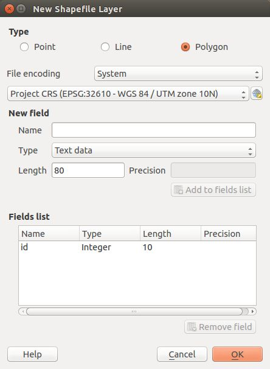
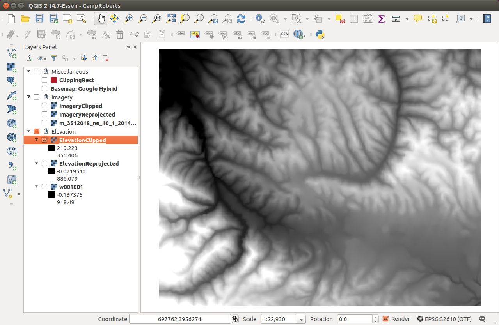

.. _terrain:

Create a Digital Terrain Model
==============================

Overview
--------

SCRIMMAGE is capable of displaying a digital terrain model as a stage for
simulation. In order to do this, we create terrain data that covers the area of
interest. This terrain data consists of an elevation file, which defines the
shape of the terrain, and an image file, which provides the terrain’s visual
texture (grass, trees, roads, etc.)

This tutorial explains how to create terrain data for an arbitrary area of
interest. Although the instructions in this tutorial use the McMillan Airfield
at Camp Roberts in California as a reference example, the procedure can be
generalized to any area of interest. In addition, these procedures demonstrate
how to create the digital terrain model with free, readily available software
and source data.

Prerequisites
~~~~~~~~~~~~~

This tutorial relies on two geographic information system (GIS) software
packages: QGIS and GRASS GIS. These software packages are free and support all
major operating systems. The QGIS software, as well as installation
instructions, can be found at
https://qgis.org/en/site/forusers/alldownloads.html. GRASS GIS can be found at
https://grass.osgeo.org. For this tutorial, QGIS 2.18.17 and GRASS GIS 7.4.0
were used on Ubuntu 18.04.

Data Source
~~~~~~~~~~~

The terrain in SCRIMMAGE is constructed from elevation data and aerial imagery.
The United States Geological Survery (USGS) provides these data sets through
`The National Map Data Download and Visualization Services`_. Its best
elevation data is 1/3 arc-second Digital Elevation Model (DEM) data. 1/3
arc-second roughly corresponds to 10 meters, so each pixel in the DEM raster
represents an approximate 10m-by-10m square of terrain. Its best aerial imagery
comes from the National Agriculture Imagery Program (NAIP). It is “four band”
(red, green, blue, infrared) imagery with a resolution of 1 meter, so each
pixel represents a 1m-by-1m square area.

SCRIMMAGE can also display extrusions of ground-based objects such as buildings.
These extrusions are constructed from polygons in a GeoJSON file that have a height
property. Many cities provide GeoJSON files with building footprints, but these files
might not have building heights. In this tutorial, we create a GeoJSON file that has a
height property. Although not used in this tutorial, Microsoft provides building
footprint data through the `Microsoft Building Footprint Data`_ wiki.

.. _The National Map Data Download and Visualization Services : https://www.usgs.gov/core-science-systems/ngp/tnm-delivery/gis-data-download

.. _Microsoft Building Footprint Data : https://wiki.openstreetmap.org/wiki/Microsoft_Building_Footprint_Data

Instructions
------------

Step 1: Setup the folder structure
~~~~~~~~~~~~~~~~~~~~~~~~~~~~~~~~~~

Before starting the QGIS program, generate a folder structure to hold a QGIS
project and its data. GIS operations are data-intensive and can generate a
large number of files, so it helps to keep your data organized. The directory
structure used in this tutorial is shown below. The “Original” folders will
contain the source data, and the “Clipped” and “Reprojected” folders will
contain data that will be generated from the source data. We will save the
final versions of our data to the “Output” folder.

Step 2: Obtain The National Map (TNM) Data
~~~~~~~~~~~~~~~~~~~~~~~~~~~~~~~~~~~~~~~~~~

The USGS `TNM Access API`_ can be used to find the downloadURLs for GIS data.
For the McMillan Airfield at Camp Roberts that is located at N35.718364,
W120.768526,  the following filter inputs were used to find the downloadURLs
for the aerial imagery and elevation data.

An alternative way to download terrain and imagery data is through the `visual TMS downloader`_.
This will allow you to see the boundaries of each product on a map so that you know you are getting
the correct data for the location you want.

For Camp Roberts, the downloadURL for the aerial imagery is
https://prd-tnm.s3.amazonaws.com/StagedProducts/NAIP/ca_2016/35120/m_3512018_ne_10_h_20160530_20161004.jp2.
This file should be downloaded to the ./Imagery/Original folder. The
downloadURL for the elevation data is
https://prd-tnm.s3.amazonaws.com/StagedProducts/Elevation/13/ArcGrid/USGS_NED_13_n36w121_ArcGrid.zip.
The contents of this folder should be extracted to the ./Elevation/Original
folder.

.. _TNM Access API : https://viewer.nationalmap.gov/tnmaccess/api/productsForm
.. _visual TMS downloader : https://viewer.nationalmap.gov/basic/

Step 3: Create a QGIS Project
~~~~~~~~~~~~~~~~~~~~~~~~~~~~~

The original data will require quite a bit of manipulation. It is in different
projections, in file formats other than our desired ones, and covers a much
larger area than we need. We will use QGIS to create a project, load the data,
manipulate it into the required projection and area, and then export it to the
correct file format.

1. Open the QGIS Desktop application.

#. Start a new project. From the menu bar, select "Project > New"

#. At the top of the Layers panel, press the “Add Group” button. A new item
   will appear in the Layers panel. Rename it to “Miscellaneous”. Repeat to
   create “Imagery” and “Elevation”. If you accidentally wind up with nested or
   out-of-order groups, you can rearrange them by drag-and-drop.

.. image:: ../images/qgis_layer.png
   :align: center

4. Next, we will set the project’s coordinate reference system (CRS). We want
   to work with a Cartesian (x/y/z) coordinate frame, so we will choose a
   projected coordinate system rather than a geodetic
   (latitude/longitude/elevation) coordinate system. Universal Transverse
   Mercator (UTM) is a popular projection with x, y, and z values measured in
   meters. If you know the latitude and longitude for the area at which you
   want to work, you can determine the corresponding UTM coordinate by using an
   online latitude/longitude-to-UTM calculator such as the one at
   https://geographiclib.sourceforge.io/cgi-bin/GeoConvert. For this tutorial,
   McMillan Airfield at Camp Roberts is located at N35.718364, W120.768526.
   Using the UTM calculator mentioned above, if I enter latitude=35.718364 and
   longitude=-120.768526, the calculator tells me that the equivalent UTM
   coordinate is zone 10N, x=701846.4901543224, y=3955007.0149711883.
   Therefore, we know we want to use WGS 84 UTM Zone 10N as our project CRS. On
   the menu bar, select “Project > Project Properties...” to bring up the
   Project Properties dialog. On the CRS tab, select the “Enable ‘on the fly’
   CRS transformation” option. In the Filter field, type “UTM 10” to search for
   the “WGS 84 / UTM zone 10N” CRS. Select it from the list and press the OK
   button

5. Finally, save the project by going to the menu bar and selecting “Project
   > Save As...”. In the resulting dialog, navigate to your root folder from
   Step 1, enter a file name (e.g. “mcmillan.qgs”), and press the Save button.
   Be sure to save periodically throughout this tutorial.

Step 4: Add a Basemap Layer
~~~~~~~~~~~~~~~~~~~~~~~~~~~

In this step, we will create a basemap layer. Note that this is not the actual
imagery we will use as the texture for our terrain model. This will be used
solely as an aid for locating and defining our area of interest.

1. Install the QuickMapServices plugin. From the menu bar, select “Plugins >
   Manage and Install Plugins...” to bring up the Plugins dialog. In the
   Search box, type “QuickMapServices”. Select the plugin from the results list
   and press the “Install plugin” button. After the plugin has finished
   installing, press the “Close” button to dismiss the Plugins dialog.

2. From the menu bar, select “Web > QuickMapServices > Search QMS” to bring
   up the Search QMS panel. Using this panel, search for “Google” and
   double-click the result “Google Terrain Hybrid [TMS]”. This will create a new item
   in the Layers panel called “Google Hybrid”. If this layer is not already in
   the Miscellaneous group, drag-and-drop it there. Right-click on the layer,
   select “Rename”, and change the layer’s name to “Basemap: Google Hybrid”.
   Close the Search QMS panel, by clicking the X box in its top right corner.

Step 5: Create a Clipping Polygon
~~~~~~~~~~~~~~~~~~~~~~~~~~~~~~~~~

1. Navigate to the area in which you’ll be working. You can use the panning
   tool (from the menu, select “View > Pan Map”) to move around the map and
   the Zoom tools (from the menu, select “View > Zoom In” or “View > Zoom Out”)
   to change the scale of the basemap. While panning, you can also use your
   mouse’s scroll wheel to zoom in and out without having to explicitly switch
   to the Zoom tools. For the Camp Roberts area, we will navigate to McMillan
   Airfield at coordinate (701900, 3955000) at a scale of approximately
   1:40,000. The current scale and the coordinate beneath the mouse cursor can
   be seen in the status bar at the bottom of the QGIS Desktop window.

#. Create a new vector layer to hold the clipping rectangle. In the Layers
   panel, select the “Miscellaneous” group. From the menu bar, select “Layer >
   Create Layer > New Shapefile Layer”. In the New Shapefile Layer dialog, set
   Type to “Polygon”. Select “Project CRS” as shown below. Press “OK” to create
   the layer. Immediately after dismissing the New Shapefile Layer dialog, QGIS
   will prompt you to save the layer’s shapefile. In the Save Layer As dialog,
   navigate to “./Miscellaneous/ClippingRect” and save the shapefile as an ESRI
   Shapefile named “ClippingRect”.

3. Right-click on the "ClippingRect" layer in the Layers Panel and select
   "Select Layer CRS". Confirm that the CRS Selector dialog is using the
   Project's CRS, which for the mcmillan QGIS project is "WGS 84 / UTM zone
   10N".

#. Next we will draw the rectangle. In the Layer panel, make sure the ClippingRect
   layer is selected. From the menu bar,
   select “Layer > Toggle Editing” to make the layer editable. From the menu
   bar, select “Edit > Add Rectangle > Add Rectangle from Center and a Point” to
   select the polygon drawing tool. Click the center of the bounding rectangle
   you wish to define and then a corner. Finish the definition by right-clicking anywhere on the map.

5. Next, we will make the rectangle semi-transparent so that we can see the
   imagery behind it. In the Layers Panel, right-click on the ClippingRect
   layer and select “Properties”. In the Layer Properties dialog, select the
   Style tab. Under Layer Rendering, change transparency/opacity to 50% and then
   press OK.

#. We are finished with the ClippingRect layer. In the Layer panel, make sure
   the ClippingRect layer is selected. From the menu bar, select “Layer >
   Toggle Editing” to stop editing the layer. QGIS will ask you if you want to
   save the changes to the layer; select “Save”.

Step 6: Process and Export the Aerial imagery
~~~~~~~~~~~~~~~~~~~~~~~~~~~~~~~~~~~~~~~~~~~~~

Next, we will manipulate the aerial imagery. Our goal for this section is to
create an image that is the size of the clipping rectangle and that is
projected into the Project CRS.

1. First, hide the Basemap layer by unchecking the checkbox next to it in the
   Layers panel.

#. Select the “Imagery” layer group in the Layers panel. From the menu bar,
   select “Layer > Add Layer > Add Raster Layer...” Select the all jp2 files in
   the “./Imagery/Original” folder, and press Open. If the expected aerial
   image doesn’t show up behind the clipping rectangle as shown below, set the
   new layer’s CRS to the appropriate value. (This value will most likely be
   found in the CRS list as “Generated CRS” with a Authority ID of
   “USER:100000”.) See step 7 in the previous section for a reminder of how to
   do this.

3. If multiple files were added to span the area of the clipping rectangle,
   then the files must be merged before any reprojection or clip extraction.
   For Camp Roberts, a merge was not necessary. However, the steps for a merge
   are provided below.

   a. From the menu bar, select “Raster > Miscellaneous > Merge...”

   #. In the Merge dialog, select “Choose input directory instead of
      files” and use the “Select” button next to the “Output file” field to
      save the new image as a GeoTIFF with the desired name and location. If
      you want to add the newly created image to your project automatically,
      select “Load into canvas when finished”. Press the “OK” button to begin
      the process. The process could take a while depending on the size of the
      source images. Also, because you’re merging multiple images into one
      image, the resulting image could be quite large. Once the process has
      completed, press the “Close” button to dismiss the dialog.

#. Next, we will reproject the imagery to the Project CRS. From the menu bar,
   select “Raster > Projections > Warp (Reproject)...” to bring up the Warp
   dialog. Using the Input File drop-down list, select the original imagery
   layer. Press the “Select...” button next to the Output File field, navigate
   to “./Imagery/Reprojected” and save the new image in it as a GeoTIFF file
   called “ImageryReprojected.tif”. Enable the Source SRS field and select
   “Generated CRS/USER:100000”. Enable the Target SRS field and set it to the
   Project CRS, which in this case is EPSG:32610 (i.e. the ID for WGS 84 UTM
   Zone 10N). Set the resampling method to “Bilinear”. Press the OK button to
   begin the operation. Depending on your machine and the size of the imagery,
   this process might take a few minutes. After the process is complete, you
   might see a warning dialog saying something like “Warning 1: Empty SOT
   marker detected: Psot=12”; if so, you can ignore it. Finally, press “Close”
   to dismiss the “Warp (Reproject)” dialog. With the original imagery layer
   hidden, the new “Reprojected” layer should appear as shown below.

5. If the new “Reprojected” layer looks washed out instead, right-click it in
   the Layer panel, select “Properties”, and go to the “Transparency” tab.
   Under “Custom transparency options”, set “Transparency band” to “None

#. Next, we will clip the reprojected image to the area of interest. From the
   menu bar, select “Raster > Extraction > Clipper...” Make sure “Input file
   (raster)” is set to “ImageryReprojected”. Use the “Select...” button next to
   the “Output file” field to navigate to “./Imagery/Clipped” and save the
   output there as a GeoTIFF file named “ImageryClipped.tif”. Under “Clipping
   mode”, select “Mask layer”, set the “Mask layer” selection to
   “ClippingRect”, and check “Crop the extent of the target dataset to the
   extent of the cutline”. Press “OK” to start the process. If this does not 
   work for you, instead click Raster > Extraction > Clip Raster by Extent. In the
   dialog, click the square button next to "Clipping extent field", select 
   "Calculate from Layer", and then the clipping layer. When done with the clipping, press
   “Close” to dismiss the Clipper dialog and then hide the “ImageryReprojected”
   and “ClippingRect” layers to see the results. Once again, if the new image
   looks washed out, set its transparency to None as mentioned in the previous
   step.

7. Finally, we will export the imagery. Our imagery is currently in a GeoTIFF
   format, but we need a JPEG image for the SCRIMMAGE simulator. From the
   menu bar, select “Raster > Conversion > Translate (Convert Format)...” On
   the Translate dialog, set “Input Layer” to “ImageryClipped”. For the output
   file, press the “Select...” button, navigate to “./Output”, and save the
   output image as a JPEG/JFIF file called “imagery.jpg”. Unselect “Load into
   canvas when finished”. I also recommend opening "Advanced Parameters" and
   manually adding “-b 1 -b 2 -b 3” to the "Additional command-line parameters"
   field. This exports only the first three (red, green, and blue) bands and
   omits any others, such as transparency or infrared bands. Press “OK” to
   begin the operation. After completion, press “Close” to dismiss the dialog.
   The resulting JPEG image is suitable for use with SCRIMMAGE.

Step 7: Process and Export the Elevation Data
~~~~~~~~~~~~~~~~~~~~~~~~~~~~~~~~~~~~~~~~~~~~~

The elevation preparation process will follow the same basic steps as the
process for the aerial imagery.

1. Select the “Elevation” layer group in the Layers panel. From the menu bar,
   select “Layer > Add Layer > Add Raster Layer...” Select the elevation data
   file,"./Elevation/Original/grdn36w121_13/w001001.adf”, and press Open. If
   the elevation data doesn’t show up behind the clipping rectangle as shown
   below, set the new layer’s CRS to the appropriate value (in this case,
   “EPSG:4269, NAD83”).

#. Next, we will reproject the elevation data to the project CRS. From the
   menu bar, select “Raster > Projections > Warp (Reproject)...” to bring up
   the Warp dialog. Using the Input File dropdown list, select the original
   elevation layer. Press the “Select...” button next to the Output File field,
   navigate to “./Elevation/Reprojected” and save the new elevation data in it
   as a GeoTIFF file named “ElevationReprojected.tif”. Enable the Target SRS
   field and set it to the project's CRS. Set the resampling method to
   “Bilinear”. Press the OK button to begin the operation. Again, this could
   take a few minutes. When the operation is complete, press “Close” to dismiss
   the Warp dialog and hide the original elevation layer to see the results.
   (You might not notice anything unless you zoom out quite a bit.)

#. Next, we will clip the reprojected elevation data to the area of interest.
   From the menu bar, select “Raster > Extraction > Clipper...” Make sure
   “Input file (raster)” is set to “ElevationReprojected”. Use the “Select...”
   button next to the “Output file” field to save the output file as a GeoTIFF
   file named “ElevationClipped.tif” in “./Elevation/Clipped”. Under “Clipping
   mode”, select “Mask layer”, set the “Mask layer” to “ClippingRect”, and
   check “Crop the extent of the target dataset to the extent of the cutline”.
   Press “OK” to start the process. Again, if this does not work for you, click
   Raster > Extraction > Clip Raster by Extent. In the dialog, click the square 
   button next to "Clipping extent field", select "Calculate from Layer", and 
   then the clipping layer. When done, press “Close” to dismiss the
   Clipper dialog and then hide the other layers to see the results.

4. Finally, we will export the elevation data from its current GeoTIFF format
   to the VTK format expected by SCRIMMAGE. This step is a bit more involved
   because QGIS doesn’t support VTK natively. We will install and use the GRASS
   package within QGIS.

   a. Start the GRASS graphical user interface.

   #. To set the GRASS GIS database directory, press the Browse button,
      navigate to parent folder for ./Ouptut, create a new folder called
      “grassdata”, then select it and press “Open”.

   #. Create a new GRASS Location. Set “Project Location” to “mcmillan”
      and “Location Title” to “mcmillan”. Press “Next”.

   #. Choose the method for creating a new location: pick “Select EPSG
      code of spatial reference system” and press “Next”.

   #. To choose an EPSG code, type ID that was used in QGIS. For example,
      for Camp Roberts, enter the ID “32610” into the “EPSG code” field. This
      corresponds to the WGS84 UTM zone 10N reference system that we’ve been
      using throughout the tutorial. Press “Next”.

   .. image:: ../images/grass_crs.png
      :width: 45 %
      :align: center
   

   f. Next, GRASS will ask you to select from a list of datum
      transformations. Select “0 - Do not apply any datum
      transformations”. Press “OK”. GRASS will show you a summary of your new
      GRASS Location. Press “Finish”.

   #. GRASS will ask you if you want to set the default region extents and
      resolution now. Select “Yes”. For Camp Roberts, set the following values:

   .. image:: ../images/grass_region.png
      :width: 45 %
      :align: center

   h. Create a new mapset called “Elevation”. Select it and then press
      “Start GRASS session”. The Layer Manager and Map Display windows
      will appear.

   #. We need to import the clipped elevation GeoTIFF created in QGIS.
      From the Layer Manager menu bar, select “File > Import raster data >
      Common formats import [r.in.gdal]”. Set “Source type” to “File” and then
      under “Source settings”, press the “Browse” button to navigate to
      “./Elevation/Clipped” and open “ElevationClipped.tif”. Back in the Import
      dialog, make sure “Add imported layers into layer tree” is selected and
      press “Import”. The elevation raster should now be visible on the Map
      Display window. Press “Close” to dismiss the Import dialog. The elevation
      raster should now be visible on the Map Display window. Press “Close” to
      dismiss the Import dialog.

   .. image:: ../images/grass_output_preview.png
      :width: 45 %
      :align: center

   j. Before exporting, we must be sure that the red computational boundary box 
      surrounds the image. To do this, click Settings > Computational Region > Set region.
      From there, select your map under "Set region to match raster maps" and click Run.

   #. From the Layer Manager menu bar, select “File > Export raster map >
      VTK    export [r.out.vtk]”. On the export dialog, select the
      “Optional” tab. Set:

      - Raster map(s) to be converted to VTK-ASCII:
        ElevationClipped@Elevation - Name for VTK-ASCII output file: use the
        browse button to navigate to “./Output” and save the file as
        “elevation.vtk”
      - Name of input elevation raster map: ElevationClipped@Elevation

   l. Press the “Run” button. After which, you are done creating your
      final elevation file. You can now close GRASS.

   #. It is a good idea to be sure that the elevation file looks correct after 
      exporting to .vtk. To visualize it, download a VTK viewer such as Paraview
      and make sure the elevation file looks correct in 3D.

Step 8 (Optional): Create Building Data
~~~~~~~~~~~~~~~~~~~~~~~~~~~~~~~~~~~~~~~

SCRIMMAGE will display ground-based polygon extrusions if the installed VTK library version is greater than or equal to 7. It obtains the location and height for these extrusions from a GeoJSON file. Thia GeoJSON file can be obtained from a data source or created with QGIS. If it is obtained from a data source, it will likely need to be processed with "Vector > Geoprocessing Tools > Clip". The following steps show how to create the GeoJSON file with QGIS.

1. Enable the ClippedImagery layer and select "View > Zoom to Layer".

#. Add a layer group between "Miscellaneous" and "Imagery". Rename it to "Building".

#. Using Step 5.2 as a reference, add a new polygon shapefile layer to the "Building" group. When creating this shapefile, add a new field with the name "Height" and use "Project CRS". Save this file to a ./Building folder and name it "Building".

#. Using Step 5.4 as a reference, add polygons to the shapefile. After creating each polygon, a prompt will ask for the "ID" and "Height" values. The "ID" value can be any arbitrary value. However, the "Height" value should be the building's height in meters.

#. Export the shapefile to a GeoJSON file. Select the Building shapefile in the layer's pane. Select "Layer > Save As" in the top menu bar. Set the format to "GeoJSON". Set the output file name such that its path is the ./output folder. Set the CRS to "Project CRS". Disable "Add saved file to map".

.. image:: ../images/qgis_geojson.png
   :scale: 40 %
   :align: center

Step 9: Use the Digital Terrain Model in SCRIMMMAGE
~~~~~~~~~~~~~~~~~~~~~~~~~~~~~~~~~~~~~~~~~~~~~~~~~~~

SCRIMMAGE uses the digital terrain model, specified in its mission file. To be
more precise, the mission file's attribute value for "terrain" is used to
select the digial terrain model that the simulation will use. SCRIMMAGE
searches within the paths defined by the ${SCRIMMAGE_DATA_PATH} environment
variable for a xml file with a relative path
"/gui/terrain/<terrain_name>/<terrain_name>.xml", where <terrain_name> matches
the  attribute value for "terrain". SCRIMMAGE uses this xml to set the aerial
imagery, elevation data, extrusion data, and CRS for the simulation. Please mimic the mcmillan terrain that is packaged with SCRIMMAGE to make your newly created terrain model accessible to SCRIMMAGE. After which, configure your mission file to load this terrain model and set the latitude and longitude parameters for the mission to be within the bounds of your terrain data.

Step 10: Accessing Digital Terrain Model Information
~~~~~~~~~~~~~~~~~~~~~~~~~~~~~~~~~~~~~~~~~~~~~~~~~~~~

In addition to displaying terrain topolgoy in the Scrimmage GUI, Scrimmage
Plugins can query elevation from the Digital Terrain Model through 
the ``terrain_map_`` member variable. Elevation data can be queried either
``QueryLongLat(double longitude, double latitude)`` or ``QueryUTM(double easting, double northing)``.
An additional boolean flag *interpolate* may be provided to these functions, i.e.
``QueryLongLat(double longitude, double latitude, bool interpolate)`` or ``QueryUTM(double easting, double northing, bool interpolate)``.
to enable bilinear interpolation of elevation data. This is disabled by default.

The underlying data representations of the elevation model utilize the native 
coordinates of the Digital Terrain Model (e.g. VTKTerrain uses UTM, DTED uses Latitude and Longitude).

A complete example of a plugin utilizing Elevation Data can be found in 
``GroundFollower.cpp``, which is similar to ``Straight.cpp``, while 
adjusting its target altitude to maintain a consistent height above the ground.

